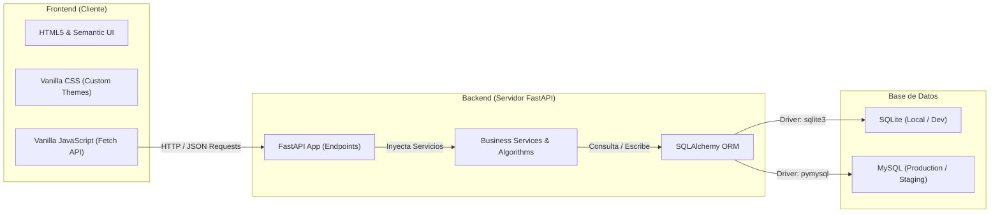
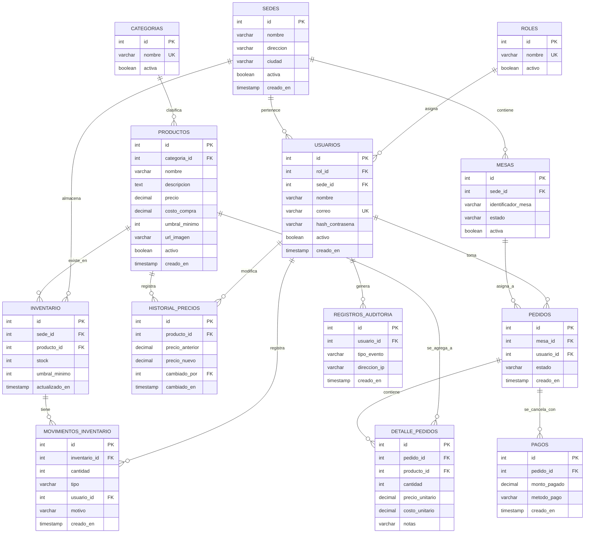

# 🏗️ Arquitectura y Estructura del Sistema

Esta sección describe la arquitectura técnica de **RutaByte**, detallando el stack tecnológico, el diseño físico de la base de datos, la estructura del código en ambos repositorios y los flujos transversales como la seguridad y la persistencia de datos.

---

## 🛠️ Stack Tecnológico

El proyecto está diseñado bajo una arquitectura desacoplada de tipo **Cliente-Servidor**, donde el frontend interactúa con el backend exclusivamente a través de una API RESTful.



### 1. Backend (Servidor)
- **FastAPI (Python):** Framework web moderno de alto rendimiento para construir APIs con tipado estático y autodocumentación interactiva (Swagger UI en `/docs`).
- **SQLAlchemy (ORM):** Mapeo objeto-relacional para interactuar de forma transparente con bases de datos relacionales utilizando dialectos intercambiables.
- **PyMySQL:** Conector de MySQL nativo de Python que permite la integración con servidores de producción.
- **PyJWT & Passlib (Bcrypt):** Criptografía avanzada para hashes de contraseñas y firma de tokens JWT.
- **Uvicorn:** Servidor ASGI ultrarrápido utilizado para desplegar la aplicación FastAPI en desarrollo y producción.

### 2. Frontend (Cliente)
- **HTML5 Semántico:** Estructura limpia y accesible de la interfaz gráfica sin frameworks pesados.
- **Vanilla CSS3:** Hojas de estilos personalizadas que garantizan una carga ultra veloz, animaciones sutiles y adaptabilidad móvil (Responsive Web Design).
- **Vanilla JavaScript (ES6+):** Lógica asíncrona mediante `Fetch API` para solicitudes HTTP estructuradas, manipulación del DOM y persistencia local del estado de sesión con `localStorage`.

### 3. Persistencia de Datos
- **Entorno de Desarrollo:** SQLite (`backend-fastapi/routabyte.db`) por defecto, requiriendo cero configuración de infraestructura local.
- **Entorno de Producción/Pruebas:** MySQL, soportando integridad referencial estricta, restricciones (`CHECK`), tipos monetarios de alta precisión (`DECIMAL`) y transacciones concurrentes ACID.

---

## 📂 Estructura de Directorios

El espacio de trabajo se organiza de forma modular. A continuación se desglosa el árbol de archivos clave para el desarrollo:

```text
RutaByte/
├── ALGORITMOS_IMPLEMENTADOS.md   # Catálogo resumido de los algoritmos académicos
├── Database.sql                 # Esquema de base de datos MySQL limpio
├── README.md                    # Introducción general del repositorio
├── Data/
│   └── rutabyte.sql             # Esquema y semilla básica MySQL
├── Docs/
│   ├── README.md                # Índice y Centro de Documentación
│   ├── ARQUITECTURA.md          # Arquitectura, base de datos y seguridad (Este archivo)
│   ├── MODULOS.md               # Detalle funcional de los módulos de negocio
│   ├── ALGORITMOS.md            # Explicación científica de los 6 algoritmos
│   ├── GUIA_DESARROLLO.md       # Guía de instalación, seeders y desarrollo
│   └── ModeloFisico/
│       ├── Modelo Fisico.png    # Diagrama entidad-relación
│       └── ModeloFisicoRutaByte.drawio
│
├── backend-fastapi/             # Módulo del Servidor FastAPI
│   ├── .env.example             # Plantilla de variables de entorno
│   ├── .env                     # Variables locales activas (Ignorado por Git)
│   ├── requirements.txt         # Dependencias del proyecto
│   ├── routabyte.db             # Base de datos SQLite local autogenerada
│   ├── app/
│   │   ├── main.py              # Punto de entrada de FastAPI y arranque
│   │   ├── api/                 # Controladores y Endpoints de la API
│   │   │   ├── admin/           # Endpoints restringidos para Administrador
│   │   │   │   ├── productos.py
│   │   │   │   ├── sedes.py
│   │   │   │   └── usuarios.py
│   │   │   ├── cajero/          # Endpoints para el rol Cajero
│   │   │   │   ├── inventario.py
│   │   │   │   └── pagos.py
│   │   │   ├── mesero/          # Endpoints para el rol Mesero
│   │   │   │   └── pedidos.py
│   │   │   ├── algoritmos.py    # Sandbox / Test de algoritmos académicos
│   │   │   ├── auth.py          # Endpoints de autenticación y recovery
│   │   │   ├── mesas.py         # ABM de mesas (reutilizado por meseros)
│   │   │   ├── reportes.py      # Endpoints analíticos y CSV
│   │   │   └── routes.py        # Endpoints comunes y healthcheck
│   │   ├── core/
│   │   │   └── security.py      # Criptografía y firmas JWT
│   │   ├── db/                  # Configuración de base de datos
│   │   │   ├── base.py          # Registro de SQLAlchemy Base
│   │   │   ├── seed.py          # Definición lógica de los seeders
│   │   │   └── session.py       # Factoría de sesiones y URL dinámicas (SQLite/MySQL)
│   │   ├── dependencies/        # Inyección de dependencias (Autenticación y Roles)
│   │   │   └── auth.py          # Middleware de validación de tokens
│   │   ├── models/              # Modelos declarativos SQLAlchemy (Tablas)
│   │   ├── schemas/             # Validadores Pydantic (Entrada/Salida de datos)
│   │   └── services/            # Lógica de negocio core y algoritmos
│   │       ├── algoritmos_service.py # Implementación pura de algoritmos
│   │       └── inventario_service.py # Lógica de movimientos y stocks
│   ├── scripts/
│   │   └── seed_initial_data.py # Script CLI para sembrar la base de datos
│   └── tests/                   # Suite de pruebas automatizadas
│       ├── test_health.py
│       └── test_sedes.py
│
└── frontend-vanilla/            # Interfaz de Usuario
    ├── README.md                # Guía rápida del frontend
    ├── index.html               # Landing page inicial y portal de acceso
    ├── login.html               # Formulario de autenticación
    ├── recuperar.html           # Recuperación de credenciales
    ├── dashboard.html           # Panel principal dinámico por roles
    ├── sedes.html               # Configuración de sedes
    ├── usuarios.html            # Gestión de personal (usuarios y roles)
    ├── productos.html           # Catálogo de productos y categorías
    ├── mesas.html               # Diseño interactivo de la distribución de la sala
    ├── pedidos.html             # Terminal de pedidos para meseros
    ├── pagos.html               # Terminal de cobro para cajeros
    ├── inventario.html          # Panel de almacén y algoritmos aplicados
    ├── reportes.html            # Panel de analítica visual (gráficos)
    ├── algoritmos.html          # Interfaz de pruebas académicas
    ├── css/                     # Hojas de estilo estructuradas por módulos
    │   ├── styles.css           # Estilos core globales y variables CSS (Variables HSL)
    │   └── [modulo].css         # Estilos específicos de cada vista
    └── js/                      # Lógica de UI interactiva y llamadas fetch
        ├── main.js              # Funciones transversales auxiliares
        ├── auth.js              # Gestor de JWT en localStorage y logout
        ├── auth-guard.js        # Protección de rutas por roles de usuario
        └── [modulo].js          # Lógica dinámica específica
```

---

## 🔒 Seguridad y Autenticación (JWT RS256)

El sistema implementa seguridad robusta basada en **JSON Web Tokens (JWT)** empleando el algoritmo **RS256** (firma asimétrica con clave privada/pública).

```text
[Cliente]                                                 [Backend FastAPI]
    │                                                            │
    │ 1. POST /auth/login {correo, password} ───────────────────>│
    │                                                            │ (Verifica contraseñas)
    │                                                            │ (Firma JWT con clave privada)
    │ <─── 2. Retorna JWT Token (Acceso) ────────────────────────│
    │                                                            │
[Guarda token en localStorage]                                   │
    │                                                            │
    │ 3. GET /cajero/inventario [Bearer JWT] ───────────────────>│
    │                                                            │ (Verifica JWT con clave pública)
    │                                                            │ (Valida si rol_id == CAJERO)
    │ <─── 4. Retorna Datos de Inventario ───────────────────────│
```

### Principios de Seguridad
1. **Firma Asimétrica (RS256):** El backend posee una clave privada (`private.pem`) con la que firma los tokens, y una clave pública (`public.pem`) para verificar su autenticidad. Esto evita la manipulación del token por parte del cliente y facilita la escalabilidad en microservicios.
2. **Expiración Estricta:** Los tokens se emiten con un tiempo de expiración (generalmente 8 horas), definido en la variable de entorno `JWT_ACCESS_TOKEN_EXPIRE_HOURS`.
3. **Control de Acceso Basado en Roles (RBAC):** La API protege los recursos mediante inyección de dependencias de FastAPI:
   - `get_current_user`: Comprueba la autenticidad básica del token y extrae el usuario activo.
   - `get_current_admin`: Valida que el token pertenezca a un usuario con `rol_id = 1` (ADMIN).
   - `get_current_cajero`: Valida que el usuario tenga rol ADMIN (1) o CAJERO (2).
   - `get_current_mesero`: Valida que el usuario tenga rol ADMIN (1) o MESERO (3).
4. **Protección del Frontend (Guards):** El archivo `frontend-vanilla/js/auth-guard.js` intercepta la carga de la página del navegador para validar el token JWT y el rol del usuario antes de pintar el DOM. Si no cumple, redirige inmediatamente a `index.html`.

---

## 💾 Modelo Físico de Base de Datos

El diseño físico mapea de forma relacional todas las entidades de negocio. Cumple con la Tercera Forma Normal (3FN), asegurando integridad mediante llaves foráneas (`FOREIGN KEY`) y restricciones de validación (`CHECK`).



### Tablas Críticas de la Base de Datos

#### 1. `PRODUCTOS`
Contiene la definición del catálogo. Se expandió para incluir `costo_compra` (esencial para el cálculo del margen en los algoritmos Voraz y Mochila) y un `umbral_minimo` global por defecto.

#### 2. `INVENTARIO` y `MOVIMIENTOS_INVENTARIO`
Relaciona los productos físicos disponibles en cada sede individual. La tabla de movimientos funciona como una bitácora contable de entradas/salidas con propósitos de auditoría (`tipo` enum: 'ENTRADA', 'SALIDA').

#### 3. `PEDIDOS` y `DETALLE_PEDIDOS`
Representa el flujo comercial del restaurante. Los estados del pedido son `EN_PREPARACION`, `LISTO` y `ENTREGADO`. Los detalles congelan el `precio_unitario` y el `costo_unitario` al momento del pedido para evitar inconsistencias históricas si el catálogo cambia de precio.

#### 4. `PAGOS`
Registra el cobro final del pedido. Al generarse un registro en esta tabla, el estado del pedido asociado pasa automáticamente a considerarse facturado y se liberan las mesas asociadas.
